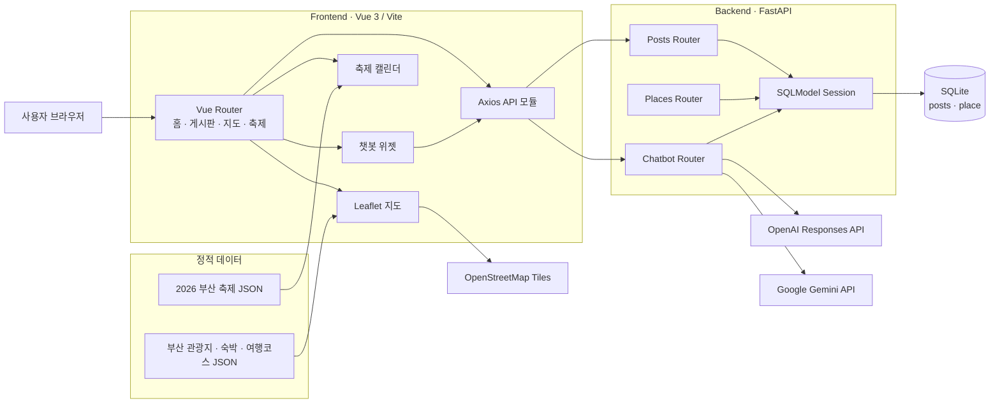
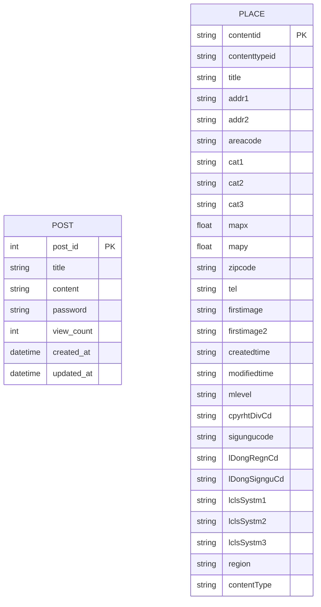

# LocalHub 부산

부산 관광 정보, 지역 커뮤니티, 축제 일정, AI 여행 안내를 한곳에서 제공하는 지역 정보 웹 서비스입니다.

광고성 정보의 범람과 여러 채널을 오가야 하는 탐색 피로를 줄이기 위해 부산의 공공 관광 데이터를 지도와 캘린더로 시각화하고, 익명 게시판과 OpenAI·Gemini 기반 챗봇을 결합했습니다.

## 목차

1. [프로젝트 개요](#1-프로젝트-개요)
2. [주요 기능](#2-주요-기능)
3. [아키텍처](#3-아키텍처)
4. [API 명세](#4-api-명세)
5. [ERD](#5-erd)
6. [테스트](#6-테스트)
7. [로컬 실행 방법](#7-로컬-실행-방법)

## 1. 프로젝트 개요

LocalHub는 부산 방문객과 지역 주민을 위한 풀스택 웹 애플리케이션입니다. 관광지·숙박·여행 코스를 지도에서 탐색하고, 2026년 부산 축제를 캘린더로 확인하며, 익명 게시판에서 지역 정보를 나눌 수 있습니다. AI 챗봇은 부산 여행 질문에 답하고 답변에 언급된 장소를 데이터베이스와 연결해 제공합니다.

### 기술 스택

| 영역 | 기술 |
|---|---|
| Frontend | Vue 3, Vite, Vue Router, Pinia, Axios |
| Map | Leaflet, Leaflet.markercluster, OpenStreetMap |
| Backend | FastAPI, SQLModel, Pydantic Settings, Uvicorn |
| Database | SQLite |
| AI | OpenAI Responses API (`openai`), Google Gemini (`google-genai`) |
| Test | pytest, FastAPI TestClient, pytest-mock, 인메모리 SQLite |

### 데이터셋

| 파일 | 용도 | 항목 수 |
|---|---|---:|
| `data/부산_관광지.json` | 관광지 지도 및 DB 적재 | 351 |
| `data/부산_숙박.json` | 숙박 지도 및 DB 적재 | 140 |
| `data/부산_여행코스.json` | 여행 코스 지도 및 DB 적재 | 22 |
| `data/부산_축제_2026.json` | 축제 캘린더 | 11 |

## 2. 주요 기능

### 부산 관광 지도

- 관광지, 숙박, 여행 코스를 카테고리별로 조회합니다.
- 부산 16개 구·군 기준 권역 필터를 제공합니다.
- Leaflet 마커 클러스터로 많은 장소를 한눈에 표시합니다.
- 장소명, 주소, 전화번호, 대표 이미지를 지도 팝업으로 확인합니다.
- 지도 화면은 저장소의 JSON 데이터를 브라우저에서 정규화해 사용합니다.

### 2026 부산 축제 캘린더

- 월별 캘린더에서 날짜별 축제와 행사 일정을 확인합니다.
- 진행 중·예정·종료 상태와 행사 기간, 장소, 설명을 제공합니다.
- 축제 좌표를 기준으로 가까운 관광지·숙박·여행 코스를 계산해 추천합니다.

### 익명 지역 게시판

- 게시글 목록, 상세 조회, 작성, 수정, 삭제를 지원합니다.
- 제목과 내용 검색, 최신순·조회수순 정렬, 클라이언트 페이지네이션을 제공합니다.
- 상세 조회 시 조회수가 증가합니다.
- 작성 시 설정한 비밀번호를 확인한 뒤 수정·삭제합니다.

> [!WARNING]
> 현재 게시글 비밀번호는 교육용 구현에 따라 평문으로 저장됩니다. 실제 서비스에서는 반드시 단방향 해시와 인증·인가 정책을 적용해야 합니다.

### OpenAI·Gemini 부산 여행 챗봇

- 모든 화면에서 플로팅 채팅 위젯을 사용할 수 있습니다.
- 관광지 추천, 축제 일정, 숙소 위치 등의 빠른 질문을 제공합니다.
- OpenAI 또는 Gemini가 생성한 한국어 답변에서 장소명 또는 숫자 ID를 찾아 DB의 장소 정보와 연결합니다.
- `auto` 모드에서는 OpenAI를 먼저 호출하고, 실패하면 Gemini로 자동 전환합니다.
- OpenAI 모델은 코드에 고정된 `gpt-5-mini`를 사용하며, Gemini 모델은 환경변수로 설정할 수 있습니다.
- 연결된 장소의 ID, 이름, 위도, 경도를 함께 반환합니다.

### 홈 대시보드

- 서비스 소개와 카테고리 바로가기를 제공합니다.
- API에서 최근 게시글 4건을 조회합니다.
- 부산 대표 장소의 지도 미리보기를 표시합니다.

## 3. 아키텍처



### 요청 흐름

1. Vue Router가 화면 전환을 담당하고 Axios 공통 클라이언트가 FastAPI에 요청합니다.
2. FastAPI는 `posts`, `places`, `chatbot` 라우터로 요청을 분리합니다.
3. 게시판과 장소 API는 SQLModel 세션을 통해 SQLite에 접근합니다.
4. 챗봇은 선택된 OpenAI 또는 Gemini 공급자의 응답을 받은 뒤 `place` 테이블에서 관련 장소를 찾아 응답에 결합합니다.
5. 지도·축제 화면은 정적 JSON을 직접 사용하며, 장소 DB는 `load_places.py`를 실행해 별도로 적재합니다.

현재 Vue 화면이 직접 호출하는 REST API는 게시글과 챗봇 API입니다. 장소 API는 독립적으로 제공되며 지도 화면에는 아직 연결되어 있지 않습니다.

### 디렉터리 구조

```text
.
├── backend/
│   ├── app/
│   │   ├── api/          # 게시글, 장소, 챗봇 라우터
│   │   ├── core/         # 환경 설정
│   │   ├── db/           # SQLModel 모델, 엔진, 세션
│   │   └── main.py       # FastAPI 앱 및 CORS 설정
│   ├── scripts/          # 장소 JSON → DB 적재 스크립트
│   └── tests/            # 백엔드 단위·통합 테스트
├── data/                 # 부산 관광 및 축제 JSON 데이터
├── frontend/
│   └── src/
│       ├── api/          # Axios API 모듈
│       ├── components/   # 레이아웃, 공통 UI, 챗봇
│       ├── data/         # 데이터 정규화 및 화면용 데이터
│       ├── router/       # Vue Router 설정
│       ├── stores/       # Pinia 스토어
│       └── views/        # 페이지 컴포넌트
└── LocalHub_Development_Tasks.md
```

## 4. API 명세

- 기본 URL: `http://localhost:8000`
- 요청·응답 형식: `application/json`
- Swagger UI: `http://localhost:8000/docs`
- ReDoc: `http://localhost:8000/redoc`

### 엔드포인트 요약

| Method | Endpoint | 설명 | 성공 응답 |
|---|---|---|---:|
| `GET` | `/api/posts` | 게시글 목록 조회 | `200` |
| `GET` | `/api/posts/{post_id}` | 게시글 상세 조회 및 조회수 증가 | `200` |
| `POST` | `/api/posts` | 게시글 작성 | `201` |
| `PUT` | `/api/posts/{post_id}` | 비밀번호 확인 후 게시글 수정 | `200` |
| `POST` | `/api/posts/{post_id}/verify-password` | 게시글 비밀번호 확인 | `200` |
| `DELETE` | `/api/posts/{post_id}` | 비밀번호 확인 후 게시글 삭제 | `200` |
| `GET` | `/api/places` | 장소 목록 검색 | `200` |
| `GET` | `/api/places/{contentid}` | 장소 상세 조회 | `200` |
| `POST` | `/api/chatbot/query` | OpenAI·Gemini 챗봇 질의 | `200` |

### 게시글 API

#### `GET /api/posts`

최신 작성순으로 게시글 목록을 반환합니다.

| Query | Type | Required | Default | 제약 |
|---|---|---:|---:|---|
| `page` | integer | No | `1` | 1 이상 |
| `page_size` | integer | No | `10` | 1~100 |

```json
[
  {
    "post_id": 1,
    "title": "광안리 야경 추천",
    "content": "저녁 산책 코스를 공유합니다.",
    "view_count": 12,
    "created_at": "2026-07-16T10:00:00",
    "updated_at": "2026-07-16T10:00:00"
  }
]
```

> 목록 응답에는 전체 건수나 다음 페이지 정보가 포함되지 않습니다. 현재 프런트엔드는 최대 100건을 가져온 뒤 검색·정렬·페이지네이션을 브라우저에서 처리합니다.

#### `GET /api/posts/{post_id}`

게시글 한 건을 반환하면서 `view_count`를 1 증가시킵니다. 게시글이 없으면 `404 Post not found`를 반환합니다.

#### `POST /api/posts`

```json
{
  "title": "광안리 야경 추천",
  "content": "저녁 산책 코스를 공유합니다.",
  "password": "1234"
}
```

`201 Created`와 함께 비밀번호를 제외한 게시글 정보를 반환합니다.

#### `PUT /api/posts/{post_id}`

```json
{
  "title": "수정된 제목",
  "content": "수정된 내용",
  "password": "1234"
}
```

비밀번호가 일치하면 제목, 내용, `updated_at`을 갱신합니다. 게시글이 없으면 `404`, 비밀번호가 다르면 `403 Invalid password`를 반환합니다.

#### `POST /api/posts/{post_id}/verify-password`

```json
{
  "password": "1234"
}
```

성공 시 `{"detail":"Password verified"}`를 반환합니다.

#### `DELETE /api/posts/{post_id}`

DELETE 요청 본문에 비밀번호를 전달합니다.

```json
{
  "password": "1234"
}
```

성공 시 `{"detail":"Post deleted successfully"}`를 반환합니다.

### 장소 API

#### `GET /api/places`

조건을 모두 만족하는 장소를 제목 오름차순으로 반환합니다.

| Query | Type | Required | 설명 |
|---|---|---:|---|
| `region` | string | No | `region` 필드 완전 일치 |
| `contenttypeid` | string | No | 관광 콘텐츠 유형 ID 완전 일치 |
| `keyword` | string | No | 장소명 부분 일치, 영문 대소문자 무시 |

예: `GET /api/places?region=해운대구&contenttypeid=12&keyword=해운대`

```json
[
  {
    "contentid": "123456",
    "contenttypeid": "12",
    "title": "해운대해수욕장",
    "addr1": "부산광역시 해운대구",
    "mapx": 129.1604,
    "mapy": 35.1587,
    "region": "부산",
    "contentType": "관광지"
  }
]
```

실제 응답에는 `place` 테이블의 전체 필드가 포함되며 값이 없는 선택 필드는 `null`입니다.

#### `GET /api/places/{contentid}`

관광 데이터의 `contentid`로 장소 한 건을 조회합니다. 장소가 없으면 `404 Place not found`를 반환합니다.

### 챗봇 API

#### `POST /api/chatbot/query`

```json
{
  "message": "광안리 근처 야경 명소를 추천해줘"
}
```

```json
{
  "answer": "광안대교 야경을 추천합니다.",
  "related_places": [
    {
      "contentid": "999",
      "title": "광안대교",
      "mapx": 129.2,
      "mapy": 35.2
    }
  ]
}
```

| 상태 | 발생 조건 |
|---:|---|
| `500` | 선택된 공급자에 사용 가능한 API 키가 없음 |
| `502` | 구성된 모든 AI 공급자 호출 실패 |
| `422` | 필수 요청 필드 누락 또는 타입 오류 |

## 5. ERD

현재 `post`와 `place`는 외래 키가 없는 독립 테이블입니다. 챗봇의 관련 장소는 응답 시점에 텍스트 또는 장소 ID로 계산하며 별도 관계 테이블에 저장하지 않습니다.



> SQLModel의 기본 테이블명은 클래스명을 소문자로 변환한 `post`, `place`입니다. `place.contentid`를 제외한 `place`의 문자열 및 좌표 필드는 선택 사항입니다.

## 6. 테스트

백엔드는 실제 OpenAI·Gemini 호출을 모킹하고 인메모리 SQLite를 사용하는 총 30개의 테스트를 포함합니다.

| 테스트 파일 | 개수 | 검증 범위 |
|---|---:|---|
| `test_posts.py` | 9 | 최신순·페이지네이션, 상세·조회수, 작성, 비밀번호 검증, 수정·삭제, 오류 응답 |
| `test_places.py` | 6 | 전체 조회, 지역·유형·키워드 필터, 상세 조회, 404 |
| `test_chatbot.py` | 15 | 장소 매칭, OpenAI 고정 모델, Gemini 호출, 공급자 우선순위·폴백, 키 누락·전체 실패 |

```bash
cd backend
python -m pytest -v
```

특정 영역만 실행하려면 다음과 같이 파일을 지정합니다.

```bash
python -m pytest tests/test_posts.py -v
python -m pytest tests/test_places.py -v
python -m pytest tests/test_chatbot.py -v
```

프런트엔드에는 별도의 자동화 테스트가 없으며 프로덕션 빌드는 다음 명령으로 확인할 수 있습니다.

```bash
cd frontend
npm run build
```

## 7. 로컬 실행 방법

### 1) 백엔드 실행

Python 3.10 이상을 권장합니다.

```bash
cd backend
python -m venv .venv
```

가상환경을 활성화합니다.

```bash
# Windows PowerShell
.venv\Scripts\Activate.ps1

# macOS / Linux
source .venv/bin/activate
```

의존성을 설치하고 `backend/.env`를 작성합니다.

```bash
pip install -r requirements.txt
```

```dotenv
DATABASE_URL=sqlite:///./localhub.db
CHATBOT_PROVIDER=auto
OPENAI_API_KEY=your_openai_api_key
GEMINI_API_KEY=your_gemini_api_key
GEMINI_MODEL=gemini-3.5-flash
ALLOWED_ORIGINS=["http://localhost:5173"]
```

`CHATBOT_PROVIDER`는 다음 값을 지원합니다.

| 값 | 동작 |
|---|---|
| `auto` | OpenAI 우선 호출 후 실패 시 Gemini로 폴백 |
| `openai` | OpenAI만 사용 |
| `gemini` | Gemini만 사용 |

OpenAI 모델은 `backend/app/api/chatbot.py`의 `OPENAI_MODEL` 상수로 고정됩니다. `OPENAI_MODEL` 환경변수는 사용하지 않으며, API 키는 저장소에 커밋하지 않도록 환경변수로만 관리합니다.

장소 데이터를 DB에 적재한 뒤 API 서버를 시작합니다.

```bash
python scripts/load_places.py
uvicorn app.main:app --reload --port 8000
```

서버 시작 시 테이블은 자동 생성됩니다. 장소 검색 및 챗봇의 장소 연결 기능을 사용하려면 데이터 적재 스크립트를 먼저 실행해야 합니다.

### 2) 프런트엔드 실행

새 터미널에서 실행합니다.

```bash
cd frontend
npm ci
```

필요하면 `frontend/.env`에서 백엔드 주소를 지정합니다. 미설정 시 `http://localhost:8000`을 사용합니다.

```dotenv
VITE_API_BASE_URL=http://localhost:8000
```

```bash
npm run dev
```

브라우저에서 `http://localhost:5173`으로 접속합니다. 지도 타일과 OpenAI·Gemini 챗봇은 외부 네트워크 연결이 필요합니다.
